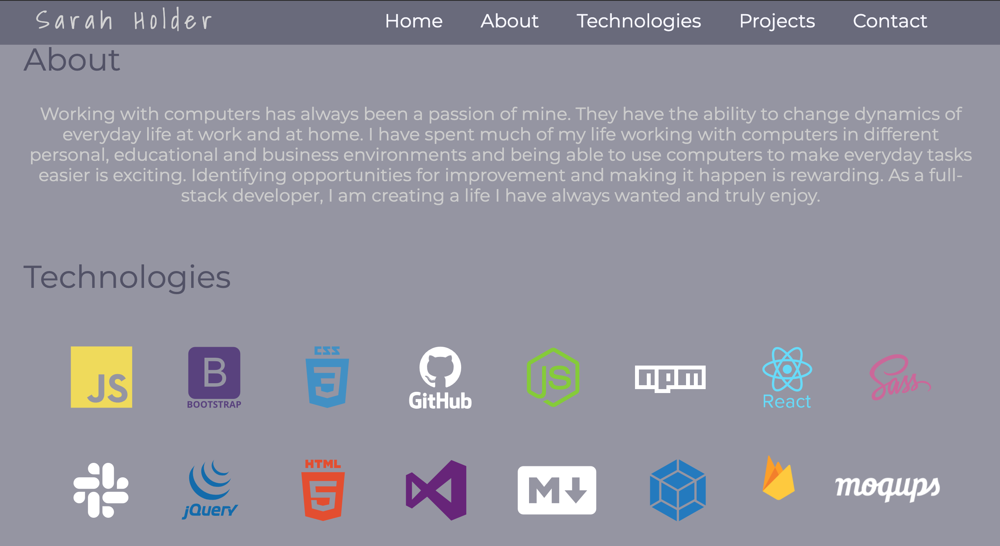

# Personal Portfolio Site

## Description

This is a portfolio website to highlight and express my personal journey as a full-stack web developer at NSS. It includes a bio section, links to firebase deployed projects, list of learned technologies, and my contact information.

## Screenshots

**Home Page**

**About and Tech View**

**Projects and Footer View**

## View deployed site: https://sarah-holder-sh.web.app/

## How to Run Locally

1. Clone repo, follow instructions [here](https://help.github.com/en/github/creating-cloning-and-archiving-repositories/cloning-a-repository#about-cloning-a-repository)

2. Use npm http-server, follow instructions [here](https://www.npmjs.com/package/http-server)

3. Use the command line interface to open copied files

4. Enter Command: `npm install`

5. Enter Command: `http-server -p 3000` or `hs -p 3000`
